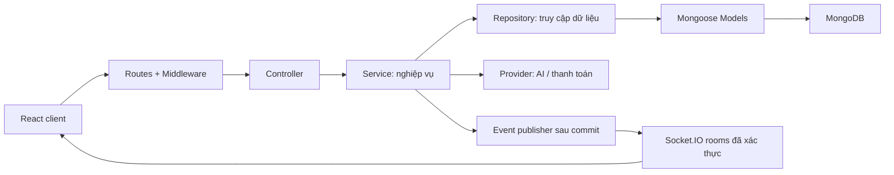

# Đặc tả giao việc cho agent: Hệ thống đặt đồ uống qua QR tại bàn tích hợp AI

> **Cách dùng:** Đưa toàn bộ file này cho agent lập trình hoặc yêu cầu: “Đọc `HUONG_DAN_AGENT_BTL_QR_AI.md` và triển khai dự án theo từng giai đoạn đến khi đạt các tiêu chí nghiệm thu.”
>
> **Vai trò của agent:** Full-stack engineer kiêm người thiết kế UI/UX. Hãy tạo một ứng dụng MERN hoàn chỉnh, có dữ liệu thật trong MongoDB, giao diện chỉn chu và tài liệu đủ để sinh viên chạy, hiểu, demo, bảo vệ bài tập lớn.
>
> **Đích chất lượng:** Hướng tới bài BTL đạt mức 9–10 nhờ nghiệp vụ đúng, kiến trúc rõ, trải nghiệm tốt, AI hữu ích và bằng chứng kiểm thử. Đây là mục tiêu tự đánh giá; điểm thực tế phụ thuộc rubric của giảng viên.

## 1. Mục tiêu và phạm vi mặc định

Tên sản phẩm tạm chọn: **Mây Café — QR Ordering & AI Barista**. Giao diện tiếng Việt có dấu, tiền tệ VND, múi giờ hiển thị `Asia/Ho_Chi_Minh`, mã nguồn và tên biến bằng tiếng Anh.

Xây dựng hệ thống cho **một quán đồ uống**, có ba không gian sử dụng:

1. **Khách tại bàn:** Quét QR → xem menu → nhận tư vấn AI → tùy chỉnh đồ uống → đặt món → theo dõi tiến độ → yêu cầu thanh toán → đánh giá.
2. **Nhân viên:** Mở phiên phục vụ cho bàn, tiếp nhận đơn, pha chế, giao món, xử lý yêu cầu và xác nhận thanh toán.
3. **Quản trị viên:** Quản lý menu, bàn, tài khoản nhân viên, lịch sử đơn và báo cáo kinh doanh.

Khách không cần đăng ký tài khoản. Mỗi thiết bị được cấp một danh tính khách trong phiên bàn. Nhiều thiết bị có thể gọi riêng tại cùng một bàn; nhân viên xem và thu tiền theo phiên bàn.

### Các mức ưu tiên

| Mức | Phạm vi | Điều kiện hoàn thành |
| --- | --- | --- |
| P0 — Nền tảng | QR, phiên bàn, menu, giỏ hàng, đặt món, phân quyền, pha chế, thanh toán tại quầy, quản trị cơ bản | Toàn bộ luồng chạy với Express và MongoDB, qua các test nghiệp vụ chính |
| P1 — Bắt buộc để đạt đích chất lượng | AI Barista thật + fallback, realtime, dashboard, thiết kế hoàn thiện, đánh giá, tài liệu và demo | Demo xuyên suốt trên điện thoại và máy tính, không có chức năng giả |
| P2 — Mở rộng sau cùng | Thanh toán sandbox, giỏ hàng cộng tác, voucher, PWA, gợi ý từ lịch sử mua, phân tích AI cho chủ quán | Chỉ làm khi P0 và P1 đã ổn định; ghi rõ những mục được chọn |

Không biến BTL thành nền tảng nhiều chi nhánh, giao hàng, microservices hay hệ thống quản lý kho nguyên liệu. Mức quản lý tồn cơ bản là trạng thái **còn bán/tạm hết** của món và topping.

## 2. Stack bắt buộc và quy ước kỹ thuật

### 2.1. MERN

- **MongoDB + Mongoose:** Lưu trữ dữ liệu nghiệp vụ, schema, index, truy vấn và transaction khi cần.
- **Express.js + Node.js + TypeScript:** REST API riêng, kiểm soát nghiệp vụ và phân quyền ở backend.
- **React + Vite + TypeScript:** Frontend dạng SPA, gọi Express API.
- **TypeScript strict** ở cả client và server. Không dùng `any` tràn lan hoặc tắt kiểm tra kiểu để vượt lỗi.
- Chọn các phiên bản stable tương thích tại thời điểm triển khai, kiểm tra tài liệu chính thức, ghi phiên bản Node trong `.nvmrc`/`engines` và commit lockfile. Không tự giả định API thư viện.

### 2.2. Bộ thư viện mặc định

| Mục đích | Lựa chọn |
| --- | --- |
| UI | Tailwind CSS, shadcn/ui, Lucide React |
| Routing | React Router |
| Dữ liệu từ server | TanStack Query |
| Trạng thái giỏ hàng cục bộ | Zustand, chỉ persist dữ liệu không nhạy cảm theo phiên |
| Form và validation | React Hook Form + Zod; backend validate lại độc lập |
| Realtime | Socket.IO |
| Biểu đồ | Recharts |
| Chuyển động | CSS; dùng thêm thư viện motion khi có nhu cầu cụ thể |
| QR | Thư viện tạo QR phù hợp Node/React, có thể xuất ảnh hoặc in |
| Kiểm thử | Vitest, React Testing Library, Supertest, Playwright |
| Chất lượng | ESLint, Prettier, typecheck, CI |

Ưu tiên npm workspaces với `client/`, `server/`, `packages/contracts/`. Nếu repository hiện có cấu trúc tốt thì thích nghi, không scaffold đè lên mã đang có.

## 3. Áp dụng hai repo frontend được yêu cầu

### 3.1. Nguồn và cách dùng

- [PatrickJS/awesome-cursorrules](https://github.com/PatrickJS/awesome-cursorrules): Thư viện quy tắc cho agent; chọn những quy tắc hợp React/TypeScript và UI. Repo hiện mô tả định dạng `.cursor/rules/*.mdc`.
- [Quy tắc React, TypeScript, shadcn/ui](https://github.com/PatrickJS/awesome-cursorrules/blob/main/rules/cursor-ai-react-typescript-shadcn-ui-cursorrules-p.mdc): Tham khảo cách tổ chức mã rõ ràng và triển khai đầy đủ.
- [Quy tắc Tailwind và shadcn/ui](https://github.com/PatrickJS/awesome-cursorrules/blob/main/rules/tailwind-shadcn-ui-integration-cursorrules-prompt-.mdc): Tham khảo yêu cầu code hoạt động, đủ imports, dễ đọc, không bỏ dở.
- [sharkqwy/v0prompt](https://github.com/sharkqwy/v0prompt): README tự mô tả là prompt v0 được reverse-engineer; xem như tài liệu tham khảo cộng đồng, không xem là đặc tả chính thức hiện hành của Vercel.
- [Nội dung prompt](https://github.com/sharkqwy/v0prompt/blob/main/prompt.txt): Chắt lọc React, Tailwind, shadcn/ui, Lucide, responsive, semantic HTML, nhãn hỗ trợ tiếp cận và component hoàn chỉnh.

### 3.2. Điều chỉnh cho dự án này

Các yêu cầu dưới đây là quyết định của BTL:

1. Dùng React SPA + Express; phần tham khảo Next.js không thay thế stack đã chọn.
2. Chia nhiều file theo feature và trách nhiệm. Không áp dụng giới hạn một file của môi trường preview v0.
3. Gọi API thật, dùng lazy loading khi phù hợp. Không áp dụng giới hạn cấm network của preview.
4. Dùng ảnh món ổn định trong assets hoặc nguồn có quyền sử dụng; không bàn giao ảnh placeholder hay đường dẫn giả.
5. Tự triển khai sau bản kế hoạch ngắn, không dừng xin xác nhận từng component.
6. Không sao chép toàn bộ prompt hệ thống từ repo. Chỉ ghi quy ước phù hợp vào tài liệu dự án.

Tạo `docs/frontend-reference-notes.md`: ghi URL, ngày truy cập, quy tắc đã áp dụng và điều chỉnh. Nếu dùng Cursor, có thể thêm rule giới hạn phạm vi frontend; tài liệu dự án vẫn phải dùng được với agent khác.

## 4. Định hướng giao diện: đẹp và có cá tính

### 4.1. Nhận diện

Phong cách **quán cà phê hiện đại, ấm, tinh gọn**. Màu nền kem, chữ espresso, điểm nhấn xanh lá đậm và caramel; ảnh đồ uống là trọng tâm.

- Token gợi ý: background `#FAF7F2`, foreground `#2B2118`, primary `#285943`, accent `#C88A4D`. Kiểm tra tương phản trước khi dùng cho chữ nhỏ hoặc nút.
- Typography dễ đọc và hỗ trợ tiếng Việt; một font cho nội dung, có thể thêm một font tiêu đề có cá tính.
- Spacing theo hệ 4/8px, bo góc và shadow thống nhất; hệ màu được khai báo qua CSS variables.
- Thiết kế riêng cho khách, nhân viên và admin, cùng nhận diện nhưng phù hợp thao tác từng nhóm.
- Animation ngắn khoảng 150–250ms, phục vụ phản hồi thao tác; tôn trọng `prefers-reduced-motion`.

### 4.2. Trải nghiệm khách trên điện thoại

- Thanh đầu hiển thị tên quán, **Bàn 05**, trạng thái phiên; không để khách nhầm bàn khi đặt.
- Ô tìm kiếm và danh mục dễ chạm, card có ảnh, giá từ, nhãn phù hợp và trạng thái hết món.
- Khu vực nổi bật giới thiệu vài món signature, không đẩy menu xuống quá xa.
- Chi tiết món dùng bottom sheet hoặc trang riêng: size, đường, đá, topping, ghi chú, giá cập nhật ngay.
- Nút mở giỏ hàng cố định phía dưới, hiển thị số lượng và tổng tiền, chừa safe area cho điện thoại.
- AI mở thành sheet trên mobile, panel trên desktop; có câu hỏi mẫu và card món tương tác.
- Trang theo dõi đơn có timeline và mô tả bước hiện tại bằng tiếng Việt.
- Sau thanh toán có hóa đơn gọn và form đánh giá dễ dùng.

### 4.3. Màn hình vận hành

- **KDS — màn hình pha chế:** Các cột “Chờ xác nhận”, “Đã nhận”, “Đang pha”, “Sẵn sàng”, có mã đơn, bàn, thời gian chờ và option món dễ đọc.
- Trạng thái “Đã phục vụ” nằm trong tab hoàn tất; không làm bảng đang xử lý bị dài vô hạn.
- Nút nhận/pha/xong/giao bấm được bằng cảm ứng; drag-and-drop là tùy chọn, không phải cách duy nhất.
- Có báo đơn mới bằng hình ảnh; âm thanh bật qua thao tác của nhân viên, có nút tắt.
- Dashboard có KPI, biểu đồ, bộ lọc ngày và bảng dữ liệu; dùng khoảng trắng và phân cấp chữ để tránh quá tải.

### 4.4. Điều kiện UI bắt buộc

- Kiểm tra viewport 375px, 768px và 1440px; không tràn ngang trang hoặc che CTA.
- Mọi trang lấy dữ liệu có loading/skeleton, empty, error/retry và success state phù hợp.
- Form có nhãn, lỗi tại trường, trạng thái gửi; dialog quản lý focus và thao tác bằng bàn phím.
- Icon button có accessible name; ảnh có alt phù hợp; trạng thái không chỉ phân biệt bằng màu.
- Vùng chạm chính tối thiểu khoảng 44 × 44px.
- Mọi nút và bộ lọc hiển thị phải hoạt động. Nội dung demo có tên món, mô tả, ảnh, giá thực tế hợp lý.
- Lưu ảnh chụp các màn hình chính sau khi kiểm tra trên trình duyệt; sửa lỗi layout trước bàn giao.

## 5. Nghiệp vụ chi tiết

### 5.1. Vai trò và quyền

| Vai trò | Quyền |
| --- | --- |
| Guest | Xem menu công khai; vào phiên bàn hợp lệ; tạo/xem đơn của thiết bị mình; yêu cầu phục vụ/thanh toán; đánh giá đơn của mình |
| Staff | Quản lý phiên bàn, xem đơn đang phục vụ, chuyển trạng thái hợp lệ, xác nhận thu tiền, xử lý yêu cầu, bật/tắt còn bán |
| Admin | Toàn bộ quyền Staff; quản lý món, danh mục, topping, bàn, tài khoản Staff, báo cáo và nhật ký |

Ẩn nút ở frontend chỉ phục vụ UX. Backend bắt buộc kiểm tra quyền ở mọi API và socket liên quan. Guest không được đọc đơn thiết bị khác chỉ nhờ biết `orderId` hoặc ngồi cùng bàn.

### 5.2. QR và vòng đời phiên bàn

1. Admin tạo bàn và QR có URL dạng `/t/{publicTableToken}`. Token ngẫu nhiên khó đoán, có thể xoay/thu hồi.
2. QR công khai chỉ xác định bàn, không chứa JWT nhân viên, bí mật hay quyền quản trị.
3. Staff mở `TableSession` khi đón khách. Mỗi bàn chỉ có một phiên đang phục vụ.
4. Khách quét QR, backend kiểm tra bàn và phiên, cấp guest session gắn `tableSessionId` và `participantId` bằng cookie HttpOnly.
5. Khách có thể xem menu khi chưa có phiên nhưng chỉ đặt được khi Staff đã mở phiên.
6. Reload trang vẫn khôi phục guest session còn hiệu lực. Khi phiên kết thúc, quyền đặt/xem đơn theo phiên đó bị thu hồi; giỏ cũ không được chuyển sang lượt khách mới.
7. Bàn tạm khóa, QR sai/đã thu hồi, phiên hết hạn hoặc đóng phải có thông báo và mã lỗi rõ.
8. Không tự gộp các thiết bị thành một danh tính khách. Giỏ hàng riêng theo thiết bị là mặc định.

**Giới hạn cần giải thích khi bảo vệ:** QR tĩnh có thể bị chụp lại; nó không chứng minh người gọi đang có mặt tại bàn. P0 giới hạn bằng phiên do Staff mở, rate limit và bước Staff xác nhận đơn. Có thể bổ sung mã tham gia ngắn hạn hiển thị tại bàn ở P2 nếu cần.

### 5.3. Menu và tùy chỉnh món

- CRUD danh mục, món, size và topping; giá từng lựa chọn; thứ tự hiển thị; ảnh; mô tả; trạng thái xuất bản/còn bán.
- Tìm kiếm tên món, lọc theo danh mục, khoảng giá và nhãn sở thích.
- Mỗi món khai báo option nào được phép, giá size, mức đường/đá và topping tương thích.
- AI và UI đọc cùng nguồn dữ liệu option; backend từ chối size/topping không hợp lệ.
- Có metadata phục vụ tư vấn: nhóm hương vị, độ ngọt mô tả, caffeine, thành phần/dị ứng đã xác nhận và option thay thế.
- Không suy diễn lượng calorie/caffeine chính xác nếu quán chưa cung cấp dữ liệu.
- “Bán chạy” phải dựa trên thống kê đơn phù hợp, hoặc được ghi rõ là món quán đề xuất nếu tuyển chọn thủ công.

### 5.4. Giỏ hàng, giá và đặt món

- Thêm/sửa/xóa món; dòng giỏ khác nhau nếu option hoặc ghi chú khác nhau.
- Số lượng là số nguyên dương, có giới hạn cấu hình. Ghi chú có giới hạn độ dài.
- Backend tính giá từ dữ liệu hiện tại: `unitPrice = sizePrice + tổng giá topping`; `lineTotal = unitPrice × quantity`.
- Tiền lưu bằng số nguyên VND. Mặc định không có thuế/phụ phí/giảm giá; nếu bổ sung phải hiển thị và tính ở server.
- Request gửi ID món/option và số lượng; không tin `price`, `total`, `role`, `tableId` hay `status` do khách gửi.
- Nếu giá đã thay đổi từ lúc khách xem giỏ, trả lỗi `PRICE_CHANGED` kèm báo giá mới để khách xác nhận, không tự thu theo giá khác.
- Chụp snapshot tên món, option, giá vào đơn để việc sửa menu không làm đổi hóa đơn cũ.
- Từ chối toàn bộ đơn nếu có món vừa hết hoặc option không hợp lệ, trả lỗi để khách sửa giỏ.
- Mỗi lần gửi đơn có `Idempotency-Key`: gửi lại cùng key và cùng payload trả cùng kết quả; cùng key khác payload trả 409. Có unique index theo khách/phiên/key.
- Khóa nút lúc gửi nhưng vẫn bảo vệ trùng đơn ở backend, kể cả retry hoặc hai request song song.

### 5.5. Trạng thái đơn

```text
PENDING → CONFIRMED → PREPARING → READY → SERVED
   └──→ CANCELLED
                CONFIRMED → CANCELLED  (Staff/Admin, có lý do)
```

- Guest được hủy đơn của mình khi còn `PENDING`.
- Staff/Admin xác nhận, bắt đầu pha, đánh dấu sẵn sàng, đã phục vụ; không nhảy bước hoặc lùi trạng thái.
- Sau `PREPARING`, không hủy trong phạm vi cơ bản; phản ánh quy tắc này trong UI.
- `SERVED` và `CANCELLED` là trạng thái cuối. Trạng thái thanh toán được quản lý riêng.
- Mỗi thay đổi lưu người thực hiện, thời điểm, trạng thái trước/sau, lý do khi cần.
- Dùng cập nhật có điều kiện theo trạng thái/version để hai nhân viên không cùng xử lý thành công một chuyển bước.

### 5.6. Thanh toán và kết thúc phiên

P0 dùng **thanh toán tại quầy do Staff xác nhận**, có bản ghi trong DB và hóa đơn. Không yêu cầu tích hợp cổng thanh toán thật để hoàn thành BTL.

1. Guest gửi yêu cầu thanh toán; Staff tiếp nhận và chuyển phiên `OPEN → CHECKOUT`.
2. `CHECKOUT` chặn đơn mới. Staff có thể trả về `OPEN` trước khi ghi nhận thanh toán nếu khách muốn gọi thêm.
3. Chỉ cho quyết toán khi mọi đơn đã `SERVED` hoặc `CANCELLED`. Tổng phải thu bằng tổng đơn `SERVED` chưa thanh toán trong phiên.
4. Staff xác nhận số tiền đã nhận. Server tính số tiền phải thu, ghi Payment, liên kết các đơn đã trả và đóng phiên trong cùng transaction.
5. Xác nhận lặp lại không tạo thanh toán trùng. Phiên không có đơn tính tiền có thể đóng với lý do, không tạo doanh thu giả.
6. Guest chỉ xem hóa đơn phần đơn của mình; Staff xem tổng hóa đơn cả bàn. Cập nhật “đã thanh toán” cho các thiết bị liên quan.
7. Bàn sẵn sàng mở phiên mới, toàn bộ guest session cũ mất quyền sử dụng.

Tránh race giữa đặt món, bắt đầu checkout và đóng phiên: các thao tác phải cùng kiểm tra/cập nhật bản ghi phiên trong transaction hoặc cơ chế khóa phiên tương đương có test song song. Chỉ đọc trạng thái phiên rồi ghi đơn ở thao tác rời là chưa đủ.

Nếu làm thanh toán online ở P2: dùng sandbox, kiểm tra chữ ký webhook, số tiền, mã giao dịch và tính lặp an toàn; không đánh dấu đã trả từ redirect/callback frontend. UI ghi rõ chế độ thử nghiệm. Không tự phát sinh giao dịch tiền thật.

### 5.7. Quản trị, báo cáo và phản hồi

- Danh sách đơn có tìm kiếm, lọc ngày/trạng thái/bàn, phân trang và trang chi tiết.
- CRUD món/danh mục/topping/bàn; quản lý QR; tạo/khóa Staff, không cho tự nâng quyền.
- Món đã xuất hiện trong đơn dùng archive/soft delete, bảo toàn lịch sử.
- Dashboard: doanh thu đã thu, số đơn đã phục vụ, giá trị trung bình đơn đã thanh toán, món bán chạy, doanh thu theo ngày/giờ.
- Ghi công thức KPI và phạm vi lọc trong tài liệu; không dùng tổng đơn tạo làm doanh thu.
- Thời gian DB lưu UTC; biên ngày báo cáo theo múi giờ quán, khoảng lọc thống nhất `[from, to)`.
- Guest đánh giá 1–5 sao và nhận xét sau khi đơn đã phục vụ, đã thanh toán; mỗi đơn một đánh giá, kiểm tra chủ sở hữu.
- Yêu cầu gọi nhân viên có trạng thái `OPEN/RESOLVED`, chống spam và xử lý trùng.

## 6. AI Barista — điểm nhấn bắt buộc

### 6.1. Trải nghiệm mong muốn

Khách nhập: **“Mình thích vị chua nhẹ, không uống cà phê, muốn ít ngọt, dưới 50 nghìn.”**

Hệ thống trả 2–3 món đang bán, có ảnh, giá và lý do phù hợp. Khách chọn “Tùy chỉnh món này”, xem size/đường/đá rồi thêm vào giỏ. AI không tự tạo đơn hay xác nhận thanh toán.

Thêm các prompt gợi ý như “Chọn món giúp mình”, “Món nào ít ngọt?”, “Đồ uống không có sữa?”. Chat UI hỗ trợ hội thoại ngắn để làm rõ sở thích, không chỉ một input trả câu văn cố định.

### 6.2. Thiết kế backend AI

```text
Client → AIController → AIService → MenuService/RecommendationService
                                 → AIProvider adapter → dịch vụ LLM
                                 → kiểm tra kết quả → response có cấu trúc
```

- `AIProvider` là interface thay thế được nhà cung cấp; cấu hình provider/model qua biến môi trường.
- Triển khai ít nhất một adapter LLM thật theo tài liệu chính thức của nhà cung cấp được chọn; API key chỉ nằm ở backend.
- Backend truy xuất một tập ứng viên từ menu đang xuất bản/còn bán, dựa trên điều kiện và ngân sách; gửi dữ liệu cần thiết cho LLM để giải thích/xếp hạng.
- Với menu vài chục món, truy xuất có cấu trúc trong MongoDB là đủ. Không bắt buộc vector database hay gắn nhãn RAG nếu chưa triển khai đúng cơ chế truy xuất.
- LLM trả schema kiểm tra được: `message`, `recommendations[{productId, variantId, reason}]`, `followUpQuestion` tùy chọn.
- Backend kiểm tra lại ID, trạng thái bán, option và ngân sách rồi bổ sung giá/ảnh từ DB. Không dùng giá do LLM tự sinh.
- Không có món thỏa điều kiện thì nói rõ và hỏi khách có muốn đổi điều kiện, không bịa món hoặc âm thầm bỏ ràng buộc.
- Mô tả món, ghi chú và lời khách đều là dữ liệu không tin cậy. Không cho chúng thay đổi quyền truy cập, chạy lệnh hay yêu cầu lộ key.
- Không gửi token, mật khẩu, dữ liệu Staff hoặc thông tin khách khác cho provider.

### 6.3. Độ tin cậy và demo không phụ thuộc mạng

- Có timeout, giới hạn độ dài hội thoại, rate limit theo khách/IP và giới hạn số lần gọi đồng thời.
- Cấu hình được `AI_PROVIDER`, `AI_MODEL`, `AI_API_KEY`, `AI_TIMEOUT_MS`, `AI_MODE`.
- Khi thiếu key, timeout hoặc lỗi provider: dùng bộ gợi ý theo luật từ menu thật. UI ghi “Gợi ý theo sở thích” và response có `mode: "fallback"`.
- Khi có provider hoạt động, response có `mode: "llm"`. Không quảng bá fallback hoặc câu trả lời hardcode là LLM thật.
- Demo offline bằng các lựa chọn sở thích có cấu trúc nếu bộ luật không hiểu được câu nhập tự do.
- Không khẳng định một món an toàn với dị ứng nếu dữ liệu nguyên liệu chưa đủ; nêu rõ thông tin còn thiếu và gợi ý hỏi nhân viên.
- Ghi latency, trạng thái, provider và token usage nếu API cung cấp; không log nguyên hội thoại hoặc key mặc định.

### 6.4. Đánh giá AI

Tạo `docs/ai-evaluation.md` và bộ dữ liệu ít nhất 15 tình huống: giới hạn ngân sách, ít ngọt, tránh caffeine, tránh sữa, hết món, option không có, không có kết quả, câu ngoài phạm vi, prompt injection, timeout.

Các invariant phải đạt 100% trong test có thể kiểm soát: không trả ID ngoài menu, không vượt ràng buộc cứng đã xác nhận, không tự tạo đơn, fallback không làm crash. Với chất lượng tư vấn bằng ngôn ngữ tự nhiên, ghi kết quả quan sát, provider/model, thời điểm chạy và trường hợp chưa tốt; không tự tạo số liệu đánh giá.

## 7. Kiến trúc backend phân tầng bắt buộc



### 7.1. Trách nhiệm từng tầng

| Tầng | Trách nhiệm | Không được làm |
| --- | --- | --- |
| Routes | Định nghĩa URL, gắn auth, validation, controller | Chứa nghiệp vụ/tính giá |
| Middleware | Xác thực, phân quyền, request ID, rate limit, xử lý lỗi | Tạo đơn hay truy vấn báo cáo thay service |
| Controller | Nhận dữ liệu đã validate, gọi service, trả status/DTO | Gọi Mongoose trực tiếp; tính tiền; gọi LLM |
| Service | Quy tắc nghiệp vụ, ownership, state machine, điều phối transaction | Phụ thuộc `req`, `res` hoặc tự viết query Mongoose |
| Repository | Query, projection, aggregation, persistence, nhận DB session từ unit of work | Quyết định ai được hủy đơn hoặc chọn HTTP status |
| Model | Schema, constraint, index và ánh xạ lưu trữ | Chứa toàn bộ use case bằng middleware Mongoose |
| Validator/DTO | Schema input, kiểu dữ liệu, cấu trúc output công khai | Để lộ password hash, token hash hoặc trường nội bộ |
| Provider | Adapter gọi dịch vụ ngoài, chuẩn hóa kết quả/lỗi | Để SDK provider xuất hiện khắp controller |

Dependency injection dùng constructor hoặc factory đơn giản; không cần framework DI. Service nhận repository interface để kiểm thử độc lập. Transaction đi qua `UnitOfWork`/transaction manager và truyền context đến repository; không kéo Mongoose query vào service.

### 7.2. Cấu trúc đề xuất

```text
project/
├── client/
│   └── src/
│       ├── app/                 # router, providers, layouts
│       ├── components/ui/       # shadcn và primitive dùng chung
│       ├── components/shared/
│       ├── features/
│       │   ├── table-session/
│       │   ├── menu/
│       │   ├── cart/
│       │   ├── orders/
│       │   ├── ai-barista/
│       │   ├── staff/
│       │   └── admin/
│       ├── lib/                 # API client, query keys, socket client
│       ├── styles/
│       └── assets/
├── server/
│   └── src/
│       ├── app.ts               # cấu hình Express, xuất app cho test
│       ├── server.ts            # khởi động HTTP, DB, Socket.IO
│       ├── config/
│       ├── routes/
│       ├── controllers/
│       ├── services/
│       ├── repositories/
│       │   └── interfaces/
│       ├── models/
│       ├── validators/
│       ├── dtos/
│       ├── middlewares/
│       ├── providers/
│       ├── infrastructure/     # DB, unit of work, logger
│       ├── realtime/
│       ├── errors/
│       ├── utils/
│       └── seeds/
├── packages/contracts/          # DTO/schema công khai; không chứa DB model
├── tests/e2e/
├── docs/
├── compose.yaml
├── .env.example
└── README.md
```

Tách theo feature bên trong các tầng khi cần. Đặt đúng tên `controllers`, không dùng `controler`. Ví dụ bắt buộc thấy rõ đường đi `order.routes → OrderController → OrderService → OrderRepository → OrderModel`.

## 8. Mô hình dữ liệu tối thiểu

| Collection | Trường và quan hệ chính |
| --- | --- |
| User | name, email unique, passwordHash, role `ADMIN/STAFF`, isActive |
| RefreshSession | userId, tokenHash, expiresAt, revokedAt, thông tin phục vụ xoay token |
| Table | code unique, name, capacity, publicTokenHash, isActive |
| TableSession | tableId, status `OPEN/CHECKOUT/CLOSED`, startedAt, closedAt, version |
| GuestSession | tableSessionId, participantId, tokenHash, expiresAt, revokedAt |
| Category | name, slug unique, sortOrder, isActive |
| Product | categoryId, name, slug, description, image, variants, allowedOptions, toppingIds, tags, ingredientMetadata, isAvailable, isArchived |
| Topping | name, price, isAvailable |
| Order | code unique, tableSessionId, participantId, items snapshot, total, status, paymentStatus, idempotencyKey, requestHash, statusHistory, version |
| Payment | tableSessionId, orderIds, amount, method, status, confirmedBy, paidAt, idempotencyKey |
| ServiceRequest | tableSessionId, participantId, type, status, createdAt, resolvedBy |
| Review | orderId unique, participantId, rating, comment, createdAt |
| AuditLog | actorId/type, action, entityType/id, metadata đã lọc, createdAt |

- Có timestamps và validation ở model cùng validation request; dữ liệu trả client dùng DTO.
- Index theo query thực tế: đơn theo phiên/thời gian, trạng thái/thời gian; payment theo paidAt; review theo orderId.
- Dùng unique partial index hoặc cơ chế atomic tương đương để một bàn chỉ có một phiên chưa đóng, bao gồm cả `OPEN` và `CHECKOUT`.
- Token lưu dạng hash khi có thể; expiry phải được kiểm tra trong request, không phụ thuộc thời điểm TTL index xóa bản ghi.
- Session/refresh token dùng TTL phù hợp; không xóa lịch sử Order/Payment theo TTL.
- Dùng MongoDB replica set cho transaction; cấu hình local phải khởi tạo và chờ replica set sẵn sàng, test integration cũng chạy trên cấu hình có transaction.

## 9. API contract và realtime

### 9.1. Quy ước API

Prefix `/api/v1`. Tạo OpenAPI đủ input, output, auth, error và ví dụ.

```json
{
  "success": true,
  "data": {},
  "meta": { "page": 1, "limit": 20, "total": 100 }
}
```

```json
{
  "success": false,
  "error": {
    "code": "PRODUCT_UNAVAILABLE",
    "message": "Một món vừa hết. Vui lòng cập nhật giỏ hàng.",
    "details": []
  },
  "requestId": "..."
}
```

`meta` chỉ xuất hiện khi cần. Dùng đúng 201/400/401/403/404/409/422/429/500; quy ước rõ 400 và 422. Không trả HTTP 200 cho mọi lỗi hoặc stack trace cho khách.

### 9.2. Nhóm endpoint tối thiểu

| Nhóm | Ví dụ endpoint | Quyền |
| --- | --- | --- |
| Auth | `POST /auth/login`, `/auth/refresh`, `/auth/logout`; `GET /auth/me` | Staff/Admin theo phiên đăng nhập |
| Menu | `GET /categories`, `/products`, `/products/:id` | Công khai, chỉ món được xuất bản |
| QR | `POST /table-sessions/join`; `GET /table-sessions/current` | Public token để join; Guest session để đọc |
| Đơn khách | `POST /orders`; `GET /orders/mine`, `/orders/:id`; `POST /orders/:id/cancel` | Guest + ownership |
| Hỗ trợ | `POST /service-requests`; `POST /checkout-requests` | Guest trong phiên hợp lệ |
| AI | `POST /ai/recommendations` | Guest, giới hạn tần suất |
| Đánh giá | `POST /orders/:id/review` | Guest + ownership + đủ điều kiện |
| Vận hành | `GET /staff/orders`; `PATCH /staff/orders/:id/status` | Staff/Admin |
| Bàn | `POST /staff/tables/:id/sessions`; `PATCH /staff/table-sessions/:id/status` | Staff/Admin, transition rõ |
| Thu tiền | `POST /staff/table-sessions/:id/payments`; `GET /staff/table-sessions/:id/bill` | Staff/Admin |
| Quản trị | `/admin/products`, `/admin/categories`, `/admin/toppings`, `/admin/tables`, `/admin/users` | Admin |
| Báo cáo | `GET /admin/reports/overview`, `/admin/reports/revenue`, `/admin/reports/top-products` | Admin |

Hoàn thiện endpoint QR rotation, availability, xử lý ServiceRequest và hóa đơn Guest trong OpenAPI. Không để UI yêu cầu một API chưa tồn tại.

### 9.3. Realtime

- Event tối thiểu: `order.created`, `order.statusChanged`, `menu.availabilityChanged`, `serviceRequest.created`, `payment.confirmed`, `tableSession.closed`.
- Payload có `eventId`, `entityId`, `version`, `occurredAt` và dữ liệu tối thiểu cho phía nhận.
- Server xác thực handshake và tự xác định room: Staff room, Guest room theo danh tính, room thông báo phiên với payload không lộ đơn khách khác.
- Client không thể tự chọn room đặc quyền chỉ bằng cách gửi `tableId` hoặc tên room.
- Chỉ phát sự kiện sau khi DB commit; mutation thất bại không được xuất hiện như thành công trên KDS.
- Client bỏ qua event cũ/trùng, refetch dữ liệu authoritative khi reconnect và invalidate query phù hợp.
- Khi socket mất kết nối có indicator và polling dự phòng có giới hạn; lỗi realtime không làm mất đơn đã lưu.
- Đóng/thu hồi phiên phải ngắt hoặc loại socket khỏi room được bảo vệ, không chỉ chặn HTTP request tiếp theo.

## 10. Bảo mật và chất lượng vận hành

- Hash mật khẩu bằng thuật toán phù hợp; rate limit login; không log password/token/API key.
- Access token nhân viên thời hạn ngắn giữ trong memory; refresh token trong cookie HttpOnly, xoay và thu hồi được. Không lưu bearer token dài hạn trong localStorage.
- Guest dùng cookie HttpOnly; cookie Secure trong HTTPS, cấu hình SameSite phù hợp. Dùng cùng origin qua proxy khi triển khai để đơn giản hóa.
- Endpoint thay đổi dữ liệu dựa trên cookie phải có chống CSRF, chẳng hạn token CSRF cùng kiểm tra Origin; không coi CORS là biện pháp CSRF đầy đủ.
- Kiểm tra ownership, role và phiên còn hiệu lực; tài khoản Staff bị khóa mất quyền qua HTTP và socket.
- Validate body/query/params, whitelist filter/sort, giới hạn page size; không đưa trực tiếp request body vào query/update MongoDB.
- Giới hạn kích thước body và nội dung chat; React render văn bản an toàn, không chèn HTML từ AI/ghi chú.
- Nếu hỗ trợ upload ảnh, giới hạn kích thước/định dạng và kiểm tra nội dung; có thể dùng bộ assets quản lý sẵn cho P0 để giảm phạm vi.
- CORS allowlist, security headers, centralized error handler, request ID và log có cấu trúc.
- Có liveness/readiness, graceful shutdown; readiness phản ánh DB có dùng được.
- AI lỗi không chặn menu/đặt món. Các trang lỗi có hành động phục hồi rõ.

## 11. Kiểm thử và tiêu chí nghiệm thu

Ưu tiên test các ranh giới nghiệp vụ và rủi ro thực tế. Không thêm test chỉ để tăng số lượng hoặc kiểm tra lại câu gán biến.

### 11.1. Unit test

- Tính giá size/topping/số lượng, input âm/lẻ/vượt giới hạn, price snapshot.
- State machine đơn; ai được hủy ở bước nào.
- Quyền và điều kiện tính tổng phiên/thu tiền.
- Lọc gợi ý AI, kiểm tra output và fallback.

### 11.2. Integration test với Express và MongoDB

- Login, refresh rotation, logout/khóa tài khoản; truy cập sai role bị chặn.
- QR sai, bàn khóa, chưa mở phiên, session hết hạn/đã đóng.
- Guest A không đọc/hủy/đánh giá đơn Guest B, kể cả cùng bàn.
- Sửa giá trên request không làm đổi số tiền; món hết và option giả bị từ chối.
- Gửi lặp và gửi song song cùng idempotency key chỉ tạo một đơn.
- Hai Staff cùng chuyển trạng thái: chỉ một cập nhật phù hợp thành công.
- Transaction rollback không để lại Payment/Order/Session mâu thuẫn.
- Đặt món đồng thời với checkout/đóng phiên không tạo đơn lọt vào phiên đã đóng.
- Xác nhận thanh toán lặp không cộng doanh thu hai lần.
- Socket không xác thực/khác phiên không đọc được event; đóng phiên thu hồi quyền.
- Reconnect khôi phục trạng thái đúng kể cả đã bỏ lỡ event.

### 11.3. E2E tối thiểu

1. Khách quét link QR → chọn món và option → đặt → KDS nhận → Staff chuyển trạng thái → Guest nhận cập nhật.
2. AI gợi ý món từ menu → tùy chỉnh → thêm giỏ → đơn được backend tính giá đúng.
3. AI provider lỗi → fallback có nhãn → vẫn đặt món được.
4. Yêu cầu thanh toán → checkout → Staff thu tiền → hóa đơn đúng → phiên đóng → khách cũ không đặt thêm được.
5. Admin đổi trạng thái hết món → menu Guest cập nhật → server chặn đặt món đã hết.
6. Nhiều Guest cùng bàn và một Guest bàn khác: đơn, thông báo và quyền không bị lẫn.

### 11.4. Definition of Done

- [ ] P0 và P1 hoàn thiện trên dữ liệu MongoDB; không còn mock data ở luồng production.
- [ ] AI adapter thật hoạt động khi được cấu hình; nếu chưa có key, báo rõ phần live chưa kiểm chứng và hướng dẫn bật, không tuyên bố test live đã qua.
- [ ] Lint, typecheck, test và production build chạy thành công; ghi lệnh và kết quả thực tế.
- [ ] Kiểm tra thủ công mobile/tablet/desktop và lưu screenshot.
- [ ] Refresh/deep link trên bản build không lỗi 404; CORS/cookie/socket hoạt động theo cách triển khai đã chọn.
- [ ] Seed chạy lại được, không tự xóa dữ liệu ngoài database demo.
- [ ] Máy mới có thể chạy bằng README; QR truy cập được từ điện thoại cùng mạng hoặc URL demo HTTPS.
- [ ] Bàn giao API docs, sơ đồ, tài khoản demo, kịch bản thuyết trình và hạn chế còn lại.

## 12. Dữ liệu demo và cách chạy

### 12.1. Seed có chất lượng

- 5 danh mục, khoảng 24 đồ uống có ảnh/mô tả/giá, 4–6 topping, 10 bàn.
- Ít nhất một món hết, một món không có topping, một món có nhiều size để thể hiện các trường hợp khác nhau.
- Một Admin, hai Staff; mật khẩu demo lấy từ cấu hình và chỉ dùng cho môi trường demo.
- Khoảng 100 đơn trong 30 ngày để biểu đồ có ý nghĩa, gồm cả đơn hủy; tổng Payment khớp đơn và statusHistory hợp lệ.
- Seed tất định bằng random seed để test/demo lặp lại được; ghi rõ dữ liệu mô phỏng trong tài liệu demo.
- Có sẵn phiên hoạt động để demo và phiên đã đóng để kiểm tra phân quyền; không mở mọi bàn ngoài ý muốn.

### 12.2. Chạy local và build

Agent phải hiện thực và kiểm chứng các script từ thư mục gốc:

```bash
npm ci
docker compose up -d
npm run db:wait
npm run seed
npm run dev
npm run lint
npm run typecheck
npm test
npm run test:e2e
npm run build
```

- `compose.yaml` tối thiểu có MongoDB replica set, volume và init/healthcheck; ghi rõ phần nào chạy Docker, phần nào chạy Node trên host.
- `.env.example` có mô tả: database, auth secret, origin, public app URL, provider AI và chế độ demo. Không chứa key thật.
- QR lấy từ `PUBLIC_APP_URL`, không hardcode localhost; hướng dẫn cấu hình địa chỉ LAN để camera điện thoại mở được ứng dụng.
- Ghi chú địa chỉ replica set cho host/container để tránh cấu hình chỉ chạy được trong một môi trường.
- Production build có tài liệu reverse proxy, HTTPS và Socket.IO trên server hỗ trợ kết nối lâu dài.
- Không tự tạo tài nguyên trả phí hoặc deploy công khai khi chưa được yêu cầu. Hoàn thiện mã và hướng dẫn triển khai trước.

## 13. Tài liệu phải bàn giao

1. `README.md`: giới thiệu, tính năng, stack, cài đặt, cấu hình, chạy, seed, test, tài khoản demo, lỗi thường gặp.
2. `docs/requirements.md`: actor, use case, user story và acceptance criteria.
3. `docs/architecture.md`: phân tầng, dependency, quyết định và đánh đổi; ví dụ một request đặt món đi qua từng tầng.
4. `docs/database.md`: sơ đồ quan hệ collection, index, snapshot và transaction.
5. `docs/api/openapi.yaml`: contract đầy đủ, có cách xem Swagger UI hoặc tương đương.
6. `docs/frontend-reference-notes.md`: liên kết hai repo và cách áp dụng.
7. `docs/design-system.md`: token, component, responsive và trạng thái UI.
8. `docs/ai-design.md` + `docs/ai-evaluation.md`: luồng AI, provider, giới hạn, fallback và kết quả kiểm chứng.
9. `docs/test-report.md`: lệnh đã chạy, kết quả, môi trường, lỗi còn lại; phân biệt test tự động và kiểm tra thủ công.
10. `docs/demo-script.md`: demo 7–10 phút, tài khoản, dữ liệu chuẩn bị và phương án mất mạng.
11. `docs/defense-notes.md`: câu hỏi bảo vệ và câu trả lời gắn với code thực tế.
12. `docs/screenshots/`: ảnh giao diện đã chạy; `docs/limitations.md`: phạm vi chưa triển khai và giới hạn đã biết.

Dùng Mermaid cho use case/luồng nghiệp vụ phù hợp, sơ đồ kiến trúc, trạng thái đơn, quan hệ collection và sequence đặt món/realtime/AI/thanh toán. Không đưa mã giả vào tài liệu như thể đó là chức năng đã hiện thực.

## 14. Kịch bản demo tạo ấn tượng

| Thời gian | Thao tác | Giá trị thể hiện |
| --- | --- | --- |
| 0:00–1:00 | Giới thiệu vấn đề, mở bàn, quét QR bằng điện thoại | Nghiệp vụ cụ thể, trải nghiệm tại bàn |
| 1:00–2:30 | Hỏi AI theo khẩu vị/ngân sách, tùy chỉnh một món được gợi ý | AI gắn menu và thao tác mua |
| 2:30–4:00 | Đặt món; đồng thời quan sát KDS trên máy tính; chuyển các bước | Realtime xuyên suốt, thao tác vận hành |
| 4:00–5:00 | Dùng thiết bị/phiên khách thứ hai; chứng minh dữ liệu không bị lẫn | Phân quyền và xử lý nhiều người |
| 5:00–6:00 | Yêu cầu thanh toán, thu tiền, đóng phiên; thử lại link phiên cũ | Vòng đời đầy đủ, kiểm soát nghiệp vụ |
| 6:00–7:00 | Mở dashboard, lọc ngày, đối chiếu giao dịch vừa tạo | Báo cáo từ dữ liệu thật |
| 7:00–8:00 | Tắt provider AI để chứng minh fallback; trình bày sơ đồ và test | Khả năng phục hồi, chất lượng kỹ thuật |

Chuẩn bị trước một đơn phục vụ nhanh và dữ liệu demo; không giảm bớt quy tắc nghiệp vụ bằng endpoint bí mật để trình diễn. Nếu dùng AI live, thử trước và có phương án fallback công khai.

## 15. Rubric tự đánh giá hướng tới 9–10

| Hạng mục | Điểm mục tiêu | Bằng chứng |
| --- | ---: | --- |
| Nghiệp vụ QR → đơn → pha chế → thu tiền | 2.5 | E2E chạy, demo thật, xử lý trường hợp lỗi |
| Kiến trúc MERN và backend phân tầng | 1.5 | Code, sơ đồ, API contract, service test |
| UI/UX và responsive | 2.0 | Giao diện nhất quán, ảnh món, trạng thái đầy đủ, demo mobile |
| AI có giá trị và có đánh giá | 1.5 | Provider thật, dữ liệu menu, gợi ý tương tác, fallback minh bạch |
| Realtime, bảo mật và tính đúng dữ liệu | 1.0 | Ownership, idempotency, transaction, reconnect test |
| Kiểm thử, tài liệu và khả năng bảo vệ | 1.5 | Test report, README chạy lại được, giải thích code và đánh đổi |
| **Tổng** | **10.0** | Đây là rubric đề xuất, điều chỉnh khi có rubric giảng viên |

**Ba điểm phải nổi bật khi xem bài:** Menu mobile đẹp và dễ đặt; AI gợi ý món dùng được ngay; đơn di chuyển đồng bộ giữa điện thoại, KDS và dashboard.

## 16. Quy trình thực thi dành cho agent

### Giai đoạn 0 — Khảo sát và chốt nền tảng

- Đọc repository và hướng dẫn hiện có, kiểm tra dependency/môi trường, giữ nguyên dữ liệu và thay đổi đang làm của người dùng.
- Đọc nguồn frontend tại mục 3, ghi chú phần áp dụng; tạo backlog theo P0/P1/P2, ghi giả định và quyết định kỹ thuật ngắn gọn.
- Thiết lập workspace, contracts, code quality, MongoDB replica set và bộ khung phân tầng.

### Giai đoạn 1 — Một lát cắt chạy xuyên suốt

- Làm seed tối thiểu → mở phiên → quét QR → lấy menu API → tạo đơn → xem đơn phía Staff.
- Có UI nền tảng đúng định hướng ngay từ đầu. Viết test giá, ownership và chống trùng trước khi mở rộng.
- Chưa bắt đầu dashboard phức tạp khi lát cắt này chưa chạy.

### Giai đoạn 2 — Hoàn thiện P0

- Auth/RBAC, CRUD, option, state machine, thanh toán, đóng phiên, log và test transaction/concurrency.
- Hoàn thiện API docs cùng lúc với endpoint; kết nối mọi màn hình với API.

### Giai đoạn 3 — Hoàn thiện P1

- Socket.IO và phục hồi kết nối; AI adapter + gợi ý có cấu trúc + fallback.
- Dashboard, đánh giá, gọi nhân viên; seed demo đầy đủ.
- Kiểm tra UI trực tiếp, sửa responsive, accessibility, loading/error/empty state.

### Giai đoạn 4 — Nghiệm thu và bàn giao

- Chạy kiểm tra bắt buộc, sửa lỗi, xác thực bằng bản production build.
- Tập demo xuyên suốt bằng hai thiết bị/browser context; hoàn thiện tài liệu và ảnh chụp.
- Chỉ làm P2 khi các điều kiện P0/P1 đã đạt. Không hy sinh sự ổn định cho số lượng tính năng.

### Quy tắc làm việc

- Khi được yêu cầu triển khai theo file này, hãy thực sự sửa/tạo file và chạy ứng dụng; không dừng ở kế hoạch hoặc các snippet rời.
- Tự quyết định các chi tiết triển khai hợp lý trong phạm vi đã giao. Chỉ hỏi khi thiếu thông tin làm thay đổi đáng kể yêu cầu, cần credential hoặc cần cấp quyền bên ngoài.
- Chưa có AI key thì vẫn hoàn thiện adapter, test giả lập provider, fallback và hướng dẫn cấu hình; ghi live verification còn thiếu.
- Không đổi MERN thành Next.js-only, Firebase hoặc Supabase; không đưa query MongoDB vào controller; không gom backend vào một `server.js` lớn.
- Không bàn giao nút không hoạt động, số liệu dashboard hardcode, chatbot trả câu cố định gắn nhãn AI hoặc mock API thay server thật.
- Không tạo abstraction/general repository phức tạp khi không cần; ưu tiên rõ ràng và sinh viên đọc hiểu được.
- Sau mỗi giai đoạn, cập nhật checklist và báo ngắn: đã làm, đã kiểm tra, còn thiếu. Không tuyên bố “hoàn thành” khi chưa qua nghiệm thu.
- Khi bàn giao, nêu cách chạy, các tài khoản demo, lệnh test và kết quả thực tế, file quan trọng, hạn chế và bước cấu hình còn cần người dùng thực hiện.

**Bắt đầu bằng việc khảo sát repository, tóm tắt quyết định triển khai, rồi thực hiện Giai đoạn 0 và lát cắt xuyên suốt ở Giai đoạn 1. Tiếp tục đến khi P0 và P1 đạt tiêu chí nghiệm thu.**
