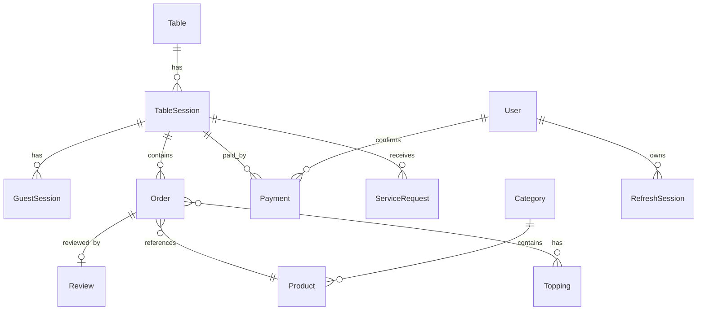

# Database — Mây Café

## Collections

| Collection | Vai trò | Index quan trọng |
| --- | --- | --- |
| `User` | Tài khoản Staff/Admin | `email` unique |
| `RefreshSession` | Refresh token, xoay/thu hồi | `tokenHash` unique, TTL `expiresAt` |
| `Table` | Bàn vật lý + QR token | `code` unique, `publicTokenHash` unique |
| `TableSession` | Phiên phục vụ theo bàn | unique partial `(tableId, status)` cho `OPEN/CHECKOUT` |
| `GuestSession` | Danh tính khách theo thiết bị | `tokenHash` unique, TTL `expiresAt` |
| `Category` | Danh mục món | `slug` unique |
| `Product` | Đồ uống, variants, options | `slug` unique |
| `Topping` | Topping | (theo `isArchived`) |
| `Order` | Đơn hàng | unique `(tableSessionId, idempotencyKey)`, `(createdAt, status)` |
| `Payment` | Giao dịch thu tiền | unique `idempotencyKey`, `paidAt` |
| `ServiceRequest` | Yêu cầu gọi nhân viên | `(tableSessionId)`, `(status)` |
| `Review` | Đánh giá đơn | `orderId` unique |
| `AuditLog` | Nhật ký thao tác nhạy cảm | `(action)`, `(createdAt)` |

## Quan hệ

## Snapshot & toàn vẹn

- **Snapshot**: `Order.items[].nameSnapshot`, `variantNameSnapshot`, `unitPrice`, `lineTotal` chụp tại thời điểm đặt. Sửa menu không làm đổi hóa đơn cũ.
- **Idempotency**: `(tableSessionId, idempotencyKey)` unique + hash payload trong `requestHash` để phát hiện replay khác payload.
- **Versioning**: `TableSession.version` tăng theo mỗi cập nhật; `Order.version` tăng theo mỗi state transition. Client phải gửi `expectedVersion` để tránh hai nhân viên cùng cập nhật thành công một bước.

## Transaction

`unitOfWork.withTransaction` dùng cho:

- `placeOrder` — tạo đơn + audit log.
- `confirmPayment` — set Payment, đổi `paymentStatus` của các đơn liên quan, đóng TableSession, revoke GuestSessions.

Yêu cầu MongoDB replica set (`compose.yaml` đã cấu hình `rs0`). Test integration dùng `mongodb-memory-server` với `replSet: { count: 1 }`.

## Timezone

- DB lưu UTC.
- `dashboardService` quy đổi sang `Asia/Ho_Chi_Minh` khi tính biên ngày.
- API nhận `from`/`to` ISO-8601; nếu không có thì mặc định 30 ngày gần nhất.
